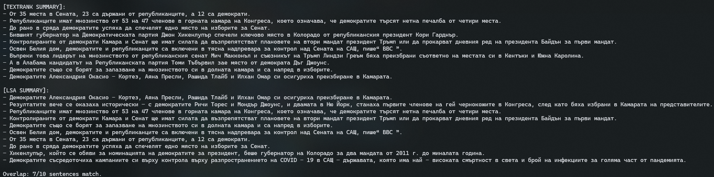

# Bulgarian Language Text Summarization: TextRank vs LSA

A comparative analysis of two extractive text summarization algorithms applied to Bulgarian language documents. This project implements and evaluates graph-based (TextRank) and matrix decomposition (LSA) approaches, incorporating linguistic features through Named Entity Recognition (NER) and Part-of-Speech (POS) tagging.

## Overview

The goal of this study is indeed to determine whether linguistic priors (POS/NER) provide significant performance boost to graph-based ranking (TextRank) or to dimensionality-reduction techniques (LSA) when processing morphologically rich languages like Bulgarian. These two fundamentally different extractive summarization methodologies are compared.

## Screenshots




### Key Features

- **Dual Algorithm Implementation**: TextRank (graph-based) and LSA (matrix decomposition)
- **Linguistic Feature Integration**: Utilizes POS tags and NER annotations for informed sentence scoring
- **Bulgarian Language Support**: Implements Bulgarian stemming and stopword filtering
- **Comprehensive Evaluation**: ROUGE metrics (ROUGE-1, ROUGE-2, ROUGE-L) comparison against gold-standard summaries
- **Parametric Analysis**: Systematic exploration of algorithm parameters and feature weights
- **Visualization**: Comparative plots and performance analysis charts

## Theoretical Background

### Extractive vs. Abstractive Summarization

This project focuses on **extractive summarization**—selecting important sentences from the original document to form the summary, as opposed to generating new text (abstractive summarization). This approach preserves linguistic correctness and factual accuracy.

### TextRank Algorithm

TextRank models a document as a graph where:
- **Nodes** represent sentences
- **Edges** represent similarity relationships between sentences (measured by shared words after stopword/stemming filtering)
- **Node Weights** are computed using the PageRank algorithm with power iteration

**Algorithm Fundamentals:**
```
1. Build sentence similarity graph
2. Normalize edge weights
3. Initialize all nodes with equal weight
4. Iteratively apply: S(Vi) = (1-d)/N + d * Σ(Vjϵ pred(Vi)) [
                      weight(Vj→Vi) * S(Vj) / Σ(Vk∈succ(Vj)) weight(Vj→Vk)
                      ]
5. Repeat until convergence (tolerance ≤ 1e-6)
6. Select top-N sentences by final score
```

**Parameters:**
- `DAMPING = 0.85`: Teleportation probability (standard PageRank value)
- `MAX_ITER = 50`: Maximum convergence iterations
- `TOL = 1e-6`: Convergence tolerance threshold

### Latent Semantic Analysis (LSA)

LSA leverages matrix decomposition to identify latent semantic structure:

**Process:**
1. Construct TF-IDF matrix: `M[i,j]` = TF-IDF weight of term j in sentence i
2. Apply Singular Value Decomposition: `M = U × Σ × V^T`
3. Reduce dimensionality to k largest singular values
4. Compute sentence scores based on their representation in the reduced semantic space
5. Select top-N sentences by cumulative singular value contribution

**Mathematical Foundation:**
- **TF (Term Frequency)**: Reflects how often a term appears in a sentence
- **IDF (Inverse Document Frequency)**: Reduces weight of common terms across the document
- **SVD Decomposition**: Extracts dominant semantic patterns explaining sentence variance

### Linguistic Feature Integration

Both algorithms are enhanced with linguistic priors:

**POS Tag Weighting:**
- NOUN/PROPN: 1.0 (high importance)
- ADJ (Adjective): 0.6
- VERB: 0.4
- Other: Not considered

**Named Entity Recognition (NER) Weighting:**
- PER (Person): 2.0
- ORG/LOC (Organization/Location): 1.5
- EVT (Event): 1.2
- PRO (Product): 1.0

**Blending Factor (Alpha):**
Sentence prior scores combine NER and POS contributions:
```
Sentence_Prior = (1 - ALPHA) * NER_Score + ALPHA * POS_Score
```

This allows exploring the trade-off between named entity prominence and grammatical structure importance.

## Technical Architecture

### System Components

```
Input Layer
    ↓
CoNLL-U Plus Parser
    ├─ Tokenization
    ├─ Linguistic Annotation Extraction
    └─ Feature Extraction
    ↓
Preprocessing Pipeline
    ├─ Bulgarian Stopword Removal
    ├─ BulStem Stemming
    └─ Linguistic Feature Weighting (POS and NER analysis)
    ↓
Summarization Methods
    ├─ TextRank (Graph-based)
    └─ LSA (Matrix Decomposition)
    ↓
Evaluation Engine
    ├─ ROUGE-1/2/L Computation
    ├─ F1-Score Analysis
    └─ Visualization Generation
    ↓
Output: Comparative Results & Plots
```

### Data Format

The project uses **CoNLL-U Plus** format—a rich linguistic annotation standard containing:
- Token-level information (ID, form, lemma, POS tag)
- Entity-level information (NER annotations)
- Multi-dimensional linguistic metadata

Example tokens from Bulgarian text are embedded with:
- Universal POS tags (NOUN, VERB, ADJ, etc.)
- Language-specific morphological features
- NER tags (B-PER, I-ORG, O, etc.)

### CoNLL File Description and Usage

The raw input data for our experiments are stored as CoNLL files under `data/raw/CoNLL/`. A **CoNLL (Conference on Natural Language Learning)** file is a plain-text tabular format where each line represents a token and columns capture various annotations.  A typical CoNLL file might contain:

1. **Token ID** – position of the word in the sentence
2. **Form** – the surface word
3. **Lemma** – dictionary form of the word
4. **UPOS/XPOS** – universal (and language-specific) POS tags
5. **Morphological features** – case, gender, number, tense, etc.
6. **Head/DepRel** – syntactic dependency information
7. **NER tag** – named-entity labels such as `B-PER`, `I-ORG`, `O`
8. **POS tag** – part‑of‑speech label (in our case, Bulgarian-specific)
9. **Miscellaneous columns** – language-specific markers, topics, etc.

Sentences are separated by blank lines, and comments (lines beginning with `#`) may contain metadata.  In our particular collection the most prevalent annotations are the **POS** and **NER** tags; other columns are sparse or unused.  The `CoNLLReader` focuses on these fields to compute sentence priors for both TextRank and LSA algorithms.

**Data availability**

The CoNLL files themselves are omitted from the repository due to licensing and distribution restrictions.  Consequently, the GitHub project contains only source code, documentation, and evaluation results.
### Evaluation Metrics

**ROUGE (Recall-Oriented Understudy for Gisting Evaluation):**

- **ROUGE-1**: Measures unigram overlap between system and reference summaries
- **ROUGE-2**: Measures bigram overlap (captures local word sequences)
- **ROUGE-L**: Measures longest common subsequence (captures document structure)

**F1-Score:** Harmonic mean of precision and recall
```
F1 = 2 × (Precision × Recall) / (Precision + Recall)
```

## Project Structure

```
├── src/
│   ├── main.py                 # Entry point for single document comparison
│   ├── TextRank.py             # TextRank algorithm implementation
│   ├── LSA.py                  # LSA algorithm implementation
│   ├── CoNLLReader.py          # CoNLL-U Plus parser & feature extractor
│   ├── run_experiment.py       # Batch evaluation with parameter sweeping
│   └── bulstem/                # Bulgarian stemming module
├── data/
│   └── raw/CoNLL/              # CoNLL-U Plus annotated documents (multiple topics)
├── resources/
│   └── BTB-StopWordList.txt    # Bulgarian stopword list
├── evaluation/
│   ├── rouge_eval.py           # ROUGE metric implementation
│   ├── chatgpt/                # Gold-standard summaries (ChatGPT-generated)
│   └── system/                 # Algorithm output summaries
├── requirements.txt            # Python dependencies
└── README.md                   # This file
```

## Installation

### Prerequisites

- Python 3.10+
- pip package manager

### Setup

1. **Clone the repository** (if on GitHub)
   ```bash
   git clone https://github.com/icydingo29/prior-weights-impact-lsa-textrank-bg
   cd prior-weights-impact-lsa-textrank-bg
   ```

2. **Create virtual environment** (recommended)
   ```bash
   python -m venv venv
   source venv/bin/activate  # On Windows: venv\Scripts\activate
   ```

3. **Install dependencies**
   ```bash
   pip install -r requirements.txt
   ```

### Dependencies

| Package | Version | Purpose |
|---------|---------|---------|
| `numpy` | 1.26.4 | Numerical computations for matrix operations |
| `matplotlib` | 3.8.2 | Generating visualization plots |
| `bulstem` | 0.3.3 | Bulgarian language stemming |

## Usage

### Single Document Summarization

Compare both algorithms on a single document:

```bash
python -m src.main
```

This runs TextRank and LSA on test documents, displaying:
- Original document text
- TextRank summary output
- LSA summary output
- Quick comparison metrics

### Batch Experiments with Parameter Sweeping

Run comprehensive evaluation across all documents with parameter optimization:

```bash
python -m src.run_experiment
```

This executes:
- **Parameter Grid Search**: Varies `TOP_N` (5, 10, 15) and `ALPHA` (0.0, 0.5, 1.0)
- **Full Dataset Evaluation**: Tests all documents in `data/raw/CoNLL/`
- **ROUGE Computation**: Compares against gold-standard summaries in `evaluation/chatgpt/`
- **Plot Generation**: Creates comparative visualization charts

**Output includes:**
- F1-scores for TextRank and LSA across all parameter combinations
- Plots comparing algorithm performance
- Alpha sweep analysis (POS vs NER weight impact)
- Top-N sentences sensitivity analysis

### Custom Usage Example

```python
from src.main import compare_summaries
from evaluation.rouge_eval import run_rouge_eval

# Generate system summaries for one document
compare_summaries(
    "data/raw/CoNLL/Brexit-00224495.conll",
    top_n=5,
    tr_out_path="evaluation/tr.txt",
    lsa_out_path="evaluation/lsa.txt",
    verbose=False,
)

# Evaluate against gold summary
scores = run_rouge_eval(
    gold_path="evaluation/chatgpt/Brexit-00224495_5.txt",
    tr_path="evaluation/tr.txt",
    lsa_path="evaluation/lsa.txt",
    verbose=True,
)
```

## Implementation Details
### Key Algorithms

**TextRank Power Iteration:**
- Custom implementation of PageRank for sentence graphs
- Iterative refinement until convergence
- Symmetric edge weights based on word overlap

**LSA Matrix Operations:**
- TF-IDF vectorization of documents
- Numpy-based Singular Value Decomposition
- Sentence importance from semantic dimensions

**Bulgarian Text Processing:**
- Stopword filtering using BTB-StopWordList
- BulStem inflectional stemming for morphological normalization
- POS/NER feature extraction from CoNLL-U Plus annotations

### Configuration Parameters

Edit `src/CoNLLReader.py` to adjust:

```python
# Sentence prior blend (POS vs NER)
ALPHA = 0.8
BETA = 1 - ALPHA

# POS strategies available for process_conll_file(..., strategy_set=...)
STRATEGY_MINIMAL = {"NOUN", "PROPN"}
STRATEGY_DESCRIPTIVE = {"NOUN", "PROPN", "ADJ"}
STRATEGY_FULL = {"NOUN", "PROPN", "ADJ", "VERB"}
```

Edit `src/run_experiment.py` to adjust experiment sweep values:

```python
SUPPORTED_TOP_NS = (5, 10, 15)
ALPHA_GRID = (0.0, 0.5, 1.0)
```

Edit `src/TextRank.py` for TextRank convergence behavior:

```python
DAMPING = 0.85
MAX_ITER = 50
TOL = 1e-6
```

## Results & Evaluation
The system evaluates summarization quality through:

1. **Quantitative Metrics**: ROUGE-1/2/L F1-scores against professional summaries
2. **Parameter Sensitivity**: Analysis of optimal `TOP_N` and `ALPHA` values
3. **Algorithm Comparison**: TextRank vs LSA performance across diverse topics
4. **Feature Impact**: Effect of linguistic features on summarization quality

Typical use cases show:
- TextRank excels at capturing document structure and inter-sentence relationships
- LSA captures latent semantic dimensions across the document
- Linguistic features significantly improve both methods' performance
- Parameter optimization yields domain-specific improvements

## Future Enhancements

- **Fine-tuned Language Models**: Integration of transformer-based models (BERT, mBERT for Bulgarian)
- **Abstractive Summarization**: Neural abstractive approaches with sequence-to-sequence models
- **Multi-Document Summarization**: Extending to summarize document collections
- **Reinforcement Learning**: Learning optimal parameter configurations through RL
- **Web Interface**: REST API or web UI for interactive summarization
- **Domain Adaptation**: Specialized models for different news categories
- **Human Evaluation**: Qualitative assessment by native Bulgarian speakers

## Technologies Used

- **Python 3.10+**: Core language
- **NumPy**: Numerical and matrix computations
- **Matplotlib**: Data visualization
- **BulStem**: Bulgarian language stemming
- **CoNLL-U Plus**: Rich linguistic annotation format

## Limitations & Considerations

- **Extractive Only**: Limited to selecting existing sentences; cannot generate novel text
- **Language-Specific**: Bulgarian stopwords and stemming tailored to Bulgarian morphology
- **Dependency on Annotations**: Relies on accurate POS tagging and NER from CoNLL-U Plus
- **Parameter Tuning**: Performance sensitive to hyperparameter selection
- **Scalability**: Computational complexity increases with document length

## Contributing

Contributions are welcome! Areas for improvement:
- Additional language support beyond Bulgarian
- Novel feature engineering techniques
- Performance optimizations for large documents
- Enhanced evaluation frameworks

## License

This project is licensed under the MIT License — see [LICENSE.md](LICENSE.md) for details.

## Authors

**Developed as a Master's coursework project** in Natural Language Processing, focusing on Bulgarian language processing and comparative algorithmic analysis of text summarization methods.

## Documentation

For questions or detailed information about methodology, refer to the accompanying project documentation and presentations included in `/documentation/`.

---

**Project Status**: Complete research implementation
**Last Updated**: 2026
**Language Focus**: Bulgarian
**Evaluation Dataset**: Diverse news topics 

